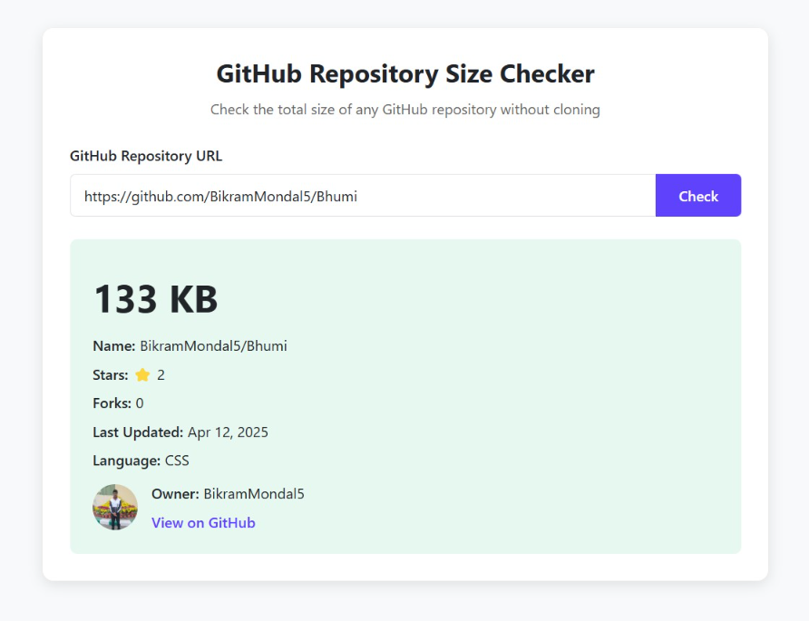

# Github-repo-size-checker

A simple, fast, and user-friendly web app that allows users to upload JPG/PNG files and convert them into a PDF file.

## 🌟 Features
- **Instant Size Information:** Check any public GitHub repository's size without cloning or downloading
- **Comprehensive Repository Details:** View stars, forks, last updated date, primary language, and owner information
- **Responsive Design:** Works seamlessly on desktop and mobile devices
- **Dark & Light Themes:** Choose your preferred visual theme
- **No Installation Required:** Pure client-side application with no dependencies
- **Privacy-Focused:** No data is stored or tracked, all queries go directly to the GitHub API

## 🛠️ Technologies Used
- **HTML** - Structure of the web page
- **CSS** - Styling and responsiveness
- **JavaScript** - To add the functionality of the webpage

## 🚀 Why This Matters❓
  **Save Bandwidth & Time**
  Before cloning large repositories, knowing their size helps you:

  - Avoid unexpected data usage on limited connections
  - Prevent filling up disk space on smaller devices
  - Make informed decisions before downloading massive codebases

  **Resource Planning**
  For developers, DevOps engineers, and teams:

  - Assess repository size before integration into CI/CD pipelines
  - Plan storage requirements for development environments
  - Quickly evaluate third-party repositories before adoption

## ⚙️ Installation

1. Clone the repository:
```bash
git clone https://github.com/BikramMondal5/Github-repo-size-checker.git
```

2. Navigate to the project directory:
```bash
cd Github-repo-size-checker
```

3. Run the `index.html` file

4. Open the web browser to preview the application.

## 📸 Screenshot


## 🤝 Contribution

Feel free to fork this repository, raise issues, or submit pull requests to add features or improve the design.

## 📜 License

This project is licensed under the `MIT License`.
